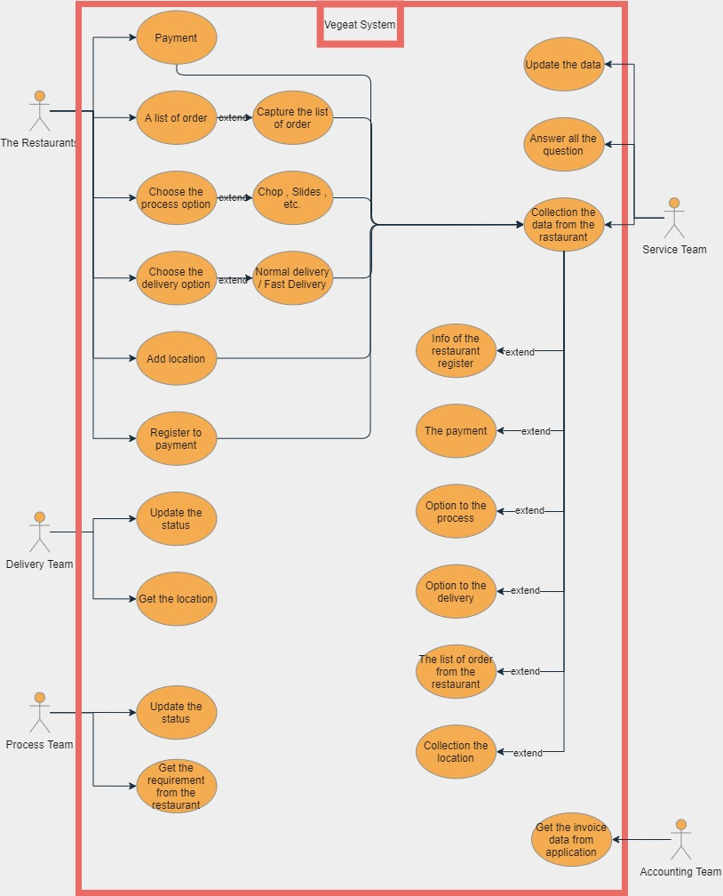
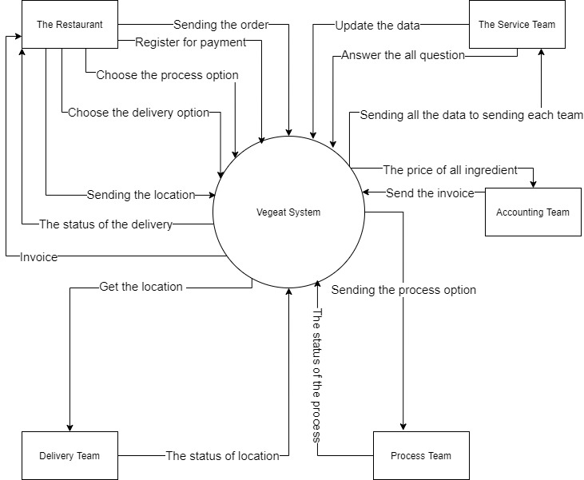

# 2020-ITCS371-1-BNLAND
**Miss Nuttida Napakas 6188033**

**Miss Kamupsorn Sansuk 6188091**

**Miss Nataree Maneesawat 6188108**

**Miss Chariyaporn Sangkaew 6088160**

**Mr. Patarapong Jomkhamsri 6188114**

**Mr. Napatr Thaithaweewattanakul 6188128**  

# Introduction

### *Section 1 : Pain point*

Every morning when I go to University, I saw the truck sell ingredients and vegetables it calls PUM PUANG’s cars. Food vendors had to come out and wait for the car every morning to buy ingredients. You can also head out to the market in the morning to buy fresh ingredients every day to prepare for the crowded meals. It is a waste of time to shop. Some shops even leave a motorcycle to buy, which each time will pay at least 50 baht delivery fee, which is unable to know whether each time will receive the number of materials ordered or will the quality be fresh or not? , Some restaurants require at least four hours to prepare ingredients, and if the ingredients are late, it may take longer to prepare them on time, so Vegeat’s would like to solve these problems including the technology that both Convenience, speed, and quality ingredients.

### *Section 2 : Concept*

Vegeat is an intermediary for delivering the ingredients between restaurant and grocery stores, also known as business to business. The method of doing this is the vegetable shop will deliver the goods to us and Vegeat will be the stockiest because it is prepared. to deliver according to the customer’s order. To save time on the cooking of the restaurant. To order ingredients will use the application of Veget, the application can convert the food picture to letter to help the users to search the item, the application will use special technology. To be convenient and quick to order food in the morning. As for anything else, Vegeat has a daily update of raw material price changes and GPS to check if Vegeat's vehicle has been delivered to your customers. Vegeat also has a stack of ingredients shop information. To make statistics to assess the quality as well and fast delivery service.

### *Section 3 : Business Strategies*

For the business Strategies Vegeat's have six main majors: starting with "raw materials", Vegeat's chooses the ingredient it has to be fresh, clean, and non-toxic. However, Vegeat’s will update the store's price information for Vegeat’s customers to let their to explore the price and can select the store at the most affordable price, Next is the choice or contact of Vegeat’s via the online application platform, the customer can choose the channel to use the product and contact the company directly or contact the company's usage issue. Number fourth of Vegeat’s is that we will refund if the ingredients that the restaurant receives are not fresh or damaged, and the final main major is that Vegeat’s has the expert employees to check the ingredients that purchased by Vegeat’s every time, which guarantees that the restaurant customers will receive the best fresh and safe, non-toxic items. For the information of the shipment is detailed. The customer can view the service purchase history at any time and the customer can set the date and time to purchase from Sunday to Monday, mostly for 7 days.

### *Section 4 : Target Customer*

The Restaurant area Salaya district (in front of Mahidol University and nearby) or restaurants that need local rare ingredients, as well as restaurants that need ingredients that are converted safely and safely. In a convenient, fast time and immediately.

### *Section 5 : Distance Shipping*

Delivery is a daily-delivery and charges are collected by distance. However, if using the “Fast Delivery” service, an additional 10% charge will be charged, starting at 20 baht when using regular delivery and 50 baht or more when using Fast Delivery service.

### *Section 6 : Future Plan*

From The Vegeat’s may lead the dry food ingredients to sale and expand the service area to be more extensive and comprehensive, and develop logistics in terms of time and quality in order to become a major source of export of raw materials to both domestic and international.

# Functional Requirements

1. Login logout and sign in sign out function.
2. categories of your restaurant.
3. Category of ingredients.
4. Capture for accepting the order.
5. Payment method.
6. Normal Delivery function and fast delivery.
7. All cart listings and editing.
8. notifications
9. Status of delivery.
10. Category of Process ingredients.
11. Dry ingredients section.
12. Easy to use (in UX, UI case).
13. Eyes color blinds can use this application.
14. Perfect for the IOS and Android version.
15. Chatting for an answer, the question of the customer.

# Non-Functional Requirements

1. Special customer section with vegeat application.
2. The day that the customer wants to order.
3. All cast for in advance order.
4. Database of information when you buy every time.
5. Set a time in advance order.
6. History previously ordered.
7. Emergency direct calling to vegeat to notice some unpredictable scenarios.
8. Trendy of order ingredients.
9. Share button to social when a customer wants to share information about this application.
10. A page to show all PR of Vegeat.

# Requirement prioritization

## Listing of requirements

- Change all colors of the list of ingredients for color blindness.
- Create and check some method to be easy to use.
- Add dry ingredient section
- Adjust the application to perfect with IOS and Android
- Special customer section added.
- Chatting section
- Emergency calling section.
- Trendy order ingredient.
- PR section

| No\. | List of requirement                                                | Type                        | Req\. Priority | Initial Sprint No\. | Final Sprint No\. | Req\. Status                        |
|------|--------------------------------------------------------------------|-----------------------------|----------------|---------------------|-------------------|-------------------------------------|
| 1    | Change all colors of the list of ingredients for color blindness\. | Functional Requirement      | 1              | 1                   | 4                 | Start the project at first month\.  |
| 2    | Create and check some method to be easy to use\.                   | Functional Requirement      | 1              | 1                   | 4                 | Start the project at first month\.  |
| 3    | Add dry ingredient section                                         | Functional Requirement      | 1              | 1                   | 4                 | Start the project at first month\.  |
| 4    | Adjust the application to perfect with IOS and Android             | Functional Requirement      | 1              | 1                   | 4                 | Start the project at first month\.  |
| 5    | Special customer section added\.                                   | Non\-Functional Requirement | 2              | 2                   | 3                 | Start the project at second month\. |
| 6    | Chatting section                                                   | Functional Requirement | 2              | 2                   | 3                 | Start the project at second month\. |
| 7    | Emergency calling section\.                                        | Non\-Functional Requirement | 3              | 4                   | 5                 | Start the project at fourth month\. |
| 8    | Trendy order ingredient\.                                          | Non\-Functional Requirement | 3              | 4                   | 5                 | Start the project at fourth month\. |
| 9    | PR section                                                         | Non\-Functional Requirement | 4              | 3                   | 5                 | Start the project at third month\.  |

# Identifying actor

### Team BNLAND

- 👩🏼‍💼Marketing Team - To Explore and plan the project .
- 👨🏻‍💼Financial Team - To plan the financial estimation.
- 👩🏻‍💻IT Team - To fixed the main platform and special technique.
- 👩🏼‍🦱Manager Team - Deal the consultancy company.
- 👨🏼‍💻Database Team - Collecting the data of all information.
- 🧑🏼‍💼UX and UI Term -  Build and make the application perfect for the customer.

### Team Vegeat

- 👲🏻Delivery Team - to deliver the ingredient follow the choice of the customer requirement.
- 👳🏻Checker Team - To checking the quality of the ingredients.
- 👨🏼‍🌾Processes Team - To do the process from the order from customer.
- 👨🏼‍💻Manager Team - Deal the consultancy company.
- 🧑🏻‍🦰Marketing Team - To Explore and plan the project .
- 👱🏽‍♀️Financial Team - To plan the financial estimation.
- 👩🏼‍🦰Services Team - To answer all the questions from the customer and manage all the manual systems.
- 👩🏼‍🦱Accounting Team - To make a invoice.

### Use case diagram

### Use case narrative
# Use case narrative :: "Change all colors of the list of ingredients for color blindness. "
| Topic           | Describe                                                                                                                                                                                                                                                                                                                                                                                                                                                                                                                                |
|-----------------|-----------------------------------------------------------------------------------------------------------------------------------------------------------------------------------------------------------------------------------------------------------------------------------------------------------------------------------------------------------------------------------------------------------------------------------------------------------------------------------------------------------------------------------------|
| Type            | Functional  Requirement                                                                                                                                                                                                                                                                                                                                                                                                                                                                                                                 |
| Iteration       | "1,Start modification : October  1 ,2020 by BNLAND :: IT Team"                                                                                                                                                                                                                                                                                                                                                                                                                                                                          |
| Primary Actor   | " IT Team"                                                                                                                                                                                                                                                                                                                                                                                                                                                                                                                              |
| Goal in context | "To make our platform or application perfect for the accessibility eye color blindness\. "                                                                                                                                                                                                                                                                                                                                                                                                                                              |
| Precondition    | The color in our application will be perfect for the color blindness with accessibility button\.                                                                                                                                                                                                                                                                                                                                                                                                                                        |
| Trigger         | It's happen when the customer have the eye color blindness and press the button change to accessibility mode\.                                                                                                                                                                                                                                                                                                                                                                                                                          |
| Scenario        | "1\. The customer choose press the accessibility mode 2\. The customer will see the color that perfect for the color of that blindness\. 3\. The customer can choose the right color that perfect to first, normal color, protanopia color , deuteranopla color and tritanopia color\. 4\. The customer start to select the ingredient ingredients or make a list and capture, then upload in application\."                                                                                                                            |
| Exceptions      | "The customer choose the wrong color and the color of button are change to the color that the customer cannot see or read it\. \(The application always have a mini circle bottom to change the color every shade that BNLAND fix for the blindness, When click it the screen will change to the whole screen of color and the customer will see in clearly by the screen will change slowly around 5 seconds and when the customer click the color that match with the customer vision it will be return to that theme of the color\." |

# Use case narrative :: "Adjust the application to perfect with IOS and Android"
| Topic           | Describe                                                                                                                                                                                                                             |
|-----------------|--------------------------------------------------------------------------------------------------------------------------------------------------------------------------------------------------------------------------------------|
| Type            | Functional  Requirement                                                                                                                                                                                                              |
| Iteration       | "1, Start modification : October  1 ,2020 by BNLAND :: UX & UI Team"                                                                                                                                                                 |
| Primary Actor   | UX & UI Team                                                                                                                                                                                                                         |
| Goal in context | "To adjust the application , function, some figure perfect for every device such as Android device and IOS device\."                                                                                                                 |
| Precondition    | "It will showing the perfect figure that fit with that OS such as download via using Playstore  will get the app that available on Android and if download via using Appstore will get the app that available on IOS\. "             |
| Trigger         | The customer who have a Android device will get the android version by download in playstore also IOS device download in appstore and will get the IOS version\.                                                                     |
| Scenario        | 1\. The customer press the right version which perfect for them 2\. In both version have a corner changing for press to go back the page previously are different\. 3\. The customer will face the a bit change in each os version\. |
| Exceptions      | The customer found the bug in the application\. \( close the application and then it will show the default page with no special UI and it have a button to click for announce to the BNLAND UX & UI Team directly\.\)                |

# Use case narrative :: "Chatting System section"
| Topic           | Describe                                                                                                                                                                                                                                                                                                                                                                                                                                                                                                                                                                                                                                                                                                     |
|-----------------|--------------------------------------------------------------------------------------------------------------------------------------------------------------------------------------------------------------------------------------------------------------------------------------------------------------------------------------------------------------------------------------------------------------------------------------------------------------------------------------------------------------------------------------------------------------------------------------------------------------------------------------------------------------------------------------------------------------|
| Type            | Functional  Requirement                                                                                                                                                                                                                                                                                                                                                                                                                                                                                                                                                                                                                                                                                 |
| Iteration       | "2, Start modification : November 15 ,2020 by BNLAND :: UX & UI Team"                                                                                                                                                                                                                                                                                                                                                                                                                                                                                                                                                                                                                                        |
| Primary Actor   | UX & UI Team                                                                                                                                                                                                                                                                                                                                                                                                                                                                                                                                                                                                                                                                                                 |
| Goal in context | To help our customer communicate with the Vegeat service team also answer the question too\.                                                                                                                                                                                                                                                                                                                                                                                                                                                                                                                                                                                                                 |
| Precondition    | "Click on ""Chat with Vegeat"" and then  the customer will start chatting with Vegeat service team "                                                                                                                                                                                                                                                                                                                                                                                                                                                                                                                                                                                                         |
| Trigger         | "The customer wondering some detail in application or want to change the order list will click ""Chat with Vegeat"" and then do the conversation\."                                                                                                                                                                                                                                                                                                                                                                                                                                                                                                                                                          |
| Scenario        | 1\.The customer press “Chat with Vegeat” 2\.the customer will asking the question\. 3\. The customer will ask permission to edit the list of order\. 4\. The customer will ask permissions to edit the process ingredients 5\. The customer will ask permission to edit the delivery 6\. The customer will ask permission to edit the destination location\.                                                                                                                                                                                                                                                                                                                                                 |
| Exceptions      | "1\. The service team answer the question are too late \(around 30 mins left\) and the topic are about the order, process , delivery or destination location\. \( The Vegeat will pay on it and giving the fast delivery to the customer in that moment\.\) 2\.The customer want to change the list of order\.\(The service team will change in directly\)  3\. The customer want to change to edit the process ingredients\. \(The service team will inform to process team\)4\. The customer want to change to edit the delivery \(\(The service team will inform to delivery team\) 5\. The customer want to change to edit the destination location\. \(The service team will inform to delivery team\)" |

### Data flow diagram Level 0 - context diagram
